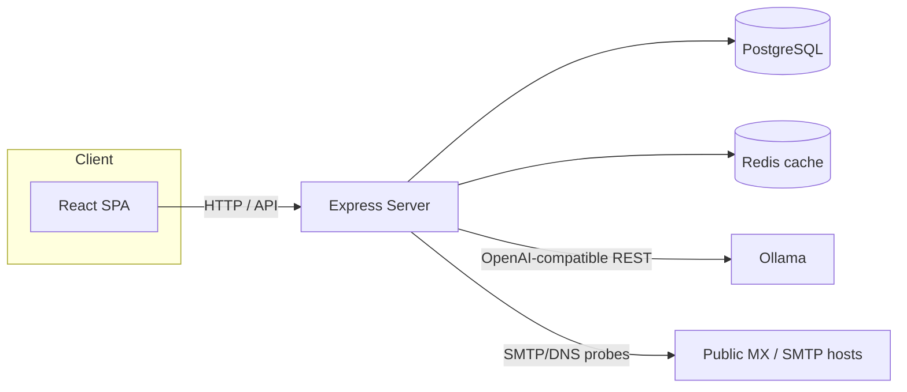

# LeadForge Pro

> **Current operating mode:** private, owner-operated lead research on the local
> machine. The Docker profile publishes the application only on
> `127.0.0.1:3000`, rejects public application/CORS URLs, and disables SMTP
> delivery. See [Phase A Local Operations](./PHASE_A_LOCAL_OPERATIONS.md).

**Private managed-lead research, verification, review, and auditable delivery operations.**


LeadForge Pro is a full-stack system the owner operates to produce client lead deliverables:

- **Lead ingestion** — validated CSV / JSON batch import, manual entry, waterfall mailbox resolution, and live domain-signal scraping
- **Verification & hygiene** — DNS/MX verification, SMTP mailbox probing, duplicate detection, disposable-domain rejection, purge automation
- **Evidence and AI assistance** — durable crawl evidence, local or remote Ollama-backed analysis, and human-readable email drafting with strict no-JSON recipient boundaries
- **Managed delivery** — durable client target profiles, exclusions, per-lead review, immutable CSV/JSON payload hashes, delivery history, and automatic payload retention
- **Optional outreach engine** — mailbox authentication, durable campaigns, suppression, signed provider events, SMTP dispatch, and tracking; disabled by the local operating profile
- **Multi-tenant by design** — PostgreSQL persistence, tenant-scoped data isolation, role-based access control

> **Security-first posture:** the codebase ships with fail-closed authentication, tenant-scoped queries, SSRF-guarded outbound networking, encrypted mailbox secrets, a structured audit log, and an honest dispatch pipeline. See [Security Model](#security-model).

---

## Table of Contents

- [Tech Stack](#tech-stack)
- [Architecture](#architecture)
- [Quick Start](#quick-start)
  - [1. Prerequisites](#1-prerequisites)
  - [2. Install dependencies](#2-install-dependencies)
  - [3. Configure environment](#3-configure-environment)
  - [4. Start PostgreSQL & Redis](#4-start-postgresql--redis)
  - [5. Run the database migration](#5-run-the-database-migration)
  - [6. Run the app](#6-run-the-app)
- [Docker Deployment](#docker-deployment)
- [Usage Guide](#usage-guide)
  - [Authentication & Roles](#authentication--roles)
  - [Core Workflows](#core-workflows)
- [Security Model](#security-model)
- [API Surface](#api-surface)
- [Project Layout](#project-layout)
- [Troubleshooting](#troubleshooting)
- [License](#license)

---

## Tech Stack

| Layer | Technology |
| :--- | :--- |
| Runtime | Node.js 22+ (TypeScript, ESM) |
| Backend | Express 4, Prisma + PostgreSQL (pg adapter) |
| AI | Local Ollama or remote HTTPS Ollama-compatible endpoint |
| Frontend | React 19 + Vite 6 + Tailwind 4 |
| Auth | JWT (HS256, audience/issuer-bound), bcryptjs |
| Security | helmet, express-rate-limit, AES-256-GCM envelope encryption |
| Deploy | Docker (multi-stage, non-root), docker-compose |

---

## Architecture



- **API server** — `server.ts` (Express), serves the SPA in production from `dist/`
- **Persistence** — Prisma models in `prisma/schema.prisma`; tenant column on every aggregate
- **AI** — `src/lib/llm.ts` supports an unauthenticated loopback Ollama daemon or an authenticated remote HTTPS endpoint; provider failures are explicit and never replaced with synthetic copy
- **Security modules** — `src/lib/security.ts` (JWT, SSRF guard, envelope encryption) and `src/lib/auditLogger.ts` (structured JSONL audit log)
---

## Quick Start

### 1. Prerequisites

- **Node.js 22+** (check with `node -v`)
- **PostgreSQL 14+** running locally (or via Docker)
- **Redis** (required for queued outbound dispatch; optional for read-only development)
- **Ollama** running locally, or a remote HTTPS Ollama-compatible endpoint and API key
- Internet access for Overture Maps, GeoNames, discovered public websites, and DuckDB's signed `httpfs` extension on first use
- **Hunter API key** only if optional named-person enrichment is enabled

### 2. Install dependencies

```bash
npm install
```

> If you use Bun: `bun install` works as well (a `bun.lock` is included).

### 3. Configure environment

Copy the example and fill in every value. **The server refuses to start with missing or weak secrets — this is intentional.**

```bash
cp .env.example .env
```

The required secrets and how to generate them:

| Variable | Purpose | Minimum | Generate with |
| :--- | :--- | :--- | :--- |
| `OLLAMA_BASE_URL` | Enables AI features; use `http://127.0.0.1:11434` locally | valid URL | `.env.example` |
| `OLLAMA_MODEL` | Installed or remote model name | non-empty | `llama3.2` |
| `OLLAMA_API_KEY` | Required only for a remote endpoint | provider-specific | provider console |
| `POSTGRES_APP_PASSWORD` | One credential used by PostgreSQL, the app container, and host Prisma commands | 32 chars | `node -e "console.log(require('crypto').randomBytes(32).toString('base64url'))"` |
| `POSTGRES_HOST_PORT` | Loopback-only PostgreSQL port for host Prisma commands | available TCP port | `55432` |
| `OWNER_EMAILS` | First local owner when the database has no users | one valid email | your operator email |
| `OWNER_PASSWORD` | Bcrypt-hashed password for the first local owner | 12 chars | `node -e "console.log(require('crypto').randomBytes(24).toString('base64url'))"` |
| `JWT_SECRET` | Session signing | 32 chars | `node -e "console.log(require('crypto').randomBytes(48).toString('base64url'))"` |
| `MAILBOX_ENCRYPTION_KEY` | AES-256 key for SMTP passwords at rest | 64 hex chars | `node -e "console.log(require('crypto').randomBytes(32).toString('hex'))"` |
| `LOCAL_ONLY_MODE` | Enforces private operator mode and rejects SMTP/public origins | `true` for Phase A | `true` |
| `HOST` | Server bind host; direct execution defaults to loopback | allowed host literal | `127.0.0.1` |
| `CONTAINERIZED` | Allows the app to listen on the container interface; host publication must remain loopback-only | boolean | `false` |
| `INBOUND_WEBHOOK_SECRET` | HMAC for inbound-reply webhooks | 32 chars | `node -e "console.log(require('crypto').randomBytes(48).toString('base64url'))"` |
| `OVERTURE_DISCOVERY_ENABLED` | Keyless Overture Places + GeoNames company discovery | `true` / `false` | `true` |
| `HUNTER_API_KEY` | Optional named-person enrichment; `test-api-key` is rejected because it returns dummy data | provider key | Hunter dashboard |
| `HUNTER_DISCOVERY_ENABLED` | Enables paid provider calls only after a real key is present | `true` / `false` | `false` |
| `HUNTER_MAX_EMAIL_CREDITS_PER_RUN` | Server-side ceiling on paid domain searches in one run | integer 0–100 | `25` |

Other useful settings:

```env
CORS_ORIGINS=https://app.your-company.com   # comma-separated; empty = same-origin only
APP_URL=https://your-company.com             # public base URL for redirects
SMTP_SENDING_ENABLED=false                  # true only when a real transport exists
# DATABASE_URL is derived automatically. For a managed database, omit
# POSTGRES_APP_PASSWORD and set DATABASE_URL explicitly instead.
REDIS_URL=redis://127.0.0.1:56379
```

> **Security:** never commit `.env`. It is git-ignored. Real secrets stay local / in your secret manager.

### 4. Start PostgreSQL & Redis

The quickest path — a snippet of `docker-compose.yaml` runs the infrastructure:

```bash
docker compose -f docker-compose.yaml up -d postgres redis
```

Or run a local PostgreSQL and create the database:

```bash
createdb leadforge_prod
```

### 5. Run the database migration

```bash
Remove-Item Env:DATABASE_URL -ErrorAction SilentlyContinue
npx prisma migrate deploy
```

This creates the tables and the tenant-scoped indexes (see `prisma/migrations/`).

### 6. Run the app

**Development** (Vite HMR + API on :3000):

```bash
npm run dev
```

**Production build** (compiles the SPA and bundles the server):

```bash
npm run build
npm start
```

Then open **http://localhost:3000**.

---

## Docker Deployment

The included `Dockerfile` is multi-stage, non-root, and serves the compiled server (`dist/server.mjs`).

```bash
# 1. Set required secrets in your shell
export OLLAMA_API_KEY=...
export JWT_SECRET="$(node -e "console.log(require('crypto').randomBytes(48).toString('base64url'))")"
export MAILBOX_ENCRYPTION_KEY="$(node -e "console.log(require('crypto').randomBytes(32).toString('hex'))")"
export INBOUND_WEBHOOK_SECRET="$(node -e "console.log(require('crypto').randomBytes(48).toString('base64url'))")"
export UNSUBSCRIBE_SECRET="$(node -e "console.log(require('crypto').randomBytes(48).toString('base64url'))")"
export DELIVERY_WEBHOOK_SECRET="$(node -e "console.log(require('crypto').randomBytes(48).toString('base64url'))")"

# 2. Bring up the full stack (app + postgres + redis)
docker compose up --build

# 3. Verify the migrations applied by the container entrypoint
docker compose exec app npx prisma migrate status
```

Notes:
- `docker-compose.yaml` **fails fast** (the `:?` syntax) if any required secret is unset.
- Rebuild and recreate the app as one immutable image; do not copy a new bundle into a container with an older dependency tree.
- PostgreSQL and Redis are **not** exposed to the host (`expose`, no `ports`).
- The app listens on `127.0.0.1:3000` in compose — put a TLS-terminating reverse proxy in front for production.

---

## Usage Guide

### Authentication & Roles

- Public registration is disabled by default. On a completely empty local database, startup creates exactly one `developer_admin` from `OWNER_EMAILS` and `OWNER_PASSWORD`; later starts never alter existing users.
- The registration endpoint, when explicitly enabled for a separately reviewed environment, derives the tenant from the email domain and assigns roles server-side. An invitation/admin-provisioning workflow is not implemented, so do not enable self-registration to add local operators.
- Roles:
  - **`developer_admin`** — settings, data reset/clear, destructive ops
  - **`sales_director`** — lead merge, bulk delete, mailbox management, dispatch
  - **`sdr_operator`** — lead create/edit, enrichment, AI personalization, exports
  - **`read_only`** — view-only telemetry and records
- Sessions are short-lived (4h) JWT cookies (`HttpOnly`, `SameSite=Strict`; `Secure` in production) — logout clears the cookie.

### Core Workflows

1. **Start Autopilot** — no niche, location, lead-database credential, or qualification form is required. LeadForge uses DroxAI's maintained seller profile and advances a persistent worldwide frontier derived from the public GeoNames city dataset.
2. **Automatic research and qualification** — each bounded run selects public businesses from Overture, researches permitted pages on their owned websites, stores timestamped snapshots and hashes, detects deterministic conversion and automation opportunity signals, and rejects candidates that do not clear the built-in evidence contract.
3. **Inspect the answer** — every qualified prospect shows why it qualified, matched observations, exact source URLs and timestamps, evidence quality, an evidence-weighted score, the best directly evidenced public contact route, and an outreach angle limited to those observations. Rejected candidates remain visible only in the audit section.
4. **Export the qualified batch** — prospect CSVs contain qualified prospects only. Exact payload bytes and SHA-256 are durable; rejected directory records cannot cross the export boundary.
5. **Use advanced overrides only when needed** — the collapsed one-off controls allow a deliberately bounded niche/location/client-contract run, but they are not required for autonomous operation. Hunter remains optional named-person enrichment after qualification and is never a discovery dependency.
6. **Optional campaign dispatch** — this remains unavailable in the default local profile. A separate public-outreach release must satisfy every gate in `PRODUCTION_REALITY_PRD.md` before SMTP can be enabled.

### CLI / Automation

```bash
npm run lint        # type-check (tsc --noEmit)
npm run build       # production build
npm test            # unit and security regression tests
npm run test:integration # integration tests; requires $TEST_API_URL
```

---

## Security Model

- **Fail-closed auth** — missing/short/known-default `JWT_SECRET` **prevents startup**; tokens are bound to audience `leadforge-api`, issuer, HS256, 4h `exp`, and a `jti`.
- **No client-asserted identity** — tenant and role come from the verified server session; registration cannot choose a role or silently join an existing domain.
- **Tenant isolation** — all queries are organization-scoped; SSE telemetry broadcasts only to the owning org; activity logs require an org scope.
- **SSRF guard** — every user-influenced outbound target (SMTP probe, mailbox connect, scrape-domain, webhook-sync) resolves DNS and rejects RFC1918/loopback/link-local/cloud-meta addresses.
- **Encrypted at rest** — mailbox credentials encrypted with AES-256-GCM (`enc:v1:` envelopes); only the environment key can decrypt.
- **Webhook integrity** — inbound replies verify an HMAC-SHA256 signature and bind the tenant to a registered mailbox.
- **Honest telemetry** — dispatches become `sent` only after the SMTP transport accepts them; disabled or unavailable dependencies fail closed.
- **Audit log** — `logs/leadforge-audit.jsonl` carries `traceId`, redacts secrets/PII, and never writes to stdout.

---

## API Surface

| Method & Path | Purpose | Auth |
| :--- | :--- | :--- |
| `POST /api/auth/register` | Self-service signup when explicitly enabled | — |
| `POST /api/auth/login` | Sign in | — |
| `GET /api/auth/me` | Current session | Bearer/cookie |
| `POST /api/auth/logout` | Clear session | — |
| `GET /api/health` | Liveness (no tenant data when unauthenticated) | — |
| `GET /api/leads`, `POST /api/leads`, `PUT /api/leads/:id` | CRUD | Bearer |
| `POST /api/leads/batch` | Batch ingest | Bearer |
| `POST /api/ingest/parse-csv`, `/api/ingest/commit-mapped-csv` | Preview and commit mapped CSV data | Bearer |
| `POST /api/leads/:id/enrich` / `ai-personalize` | Enrichment / AI | Bearer |
| `POST /api/mailboxes`, `/api/mailboxes/:id/test` | SMTP mailbox connect/test | sales-leadership |
| `POST /api/mailboxes/dispatch` | Live one-off SMTP dispatch with suppression enforcement | sales-leadership |
| `GET`, `POST`, `PUT /api/campaigns` | Durable campaign and step management | tenant / sales-leadership |
| `POST /api/campaigns/:id/launch` | Atomically enroll leads and schedule every campaign step | sales-leadership |
| `POST /api/campaigns/:id/pause`, `/resume` | Stop or resume scheduled campaign sends | sales-leadership |
| `GET`, `POST`, `DELETE /api/suppressions` | Tenant suppression management | tenant / sales-leadership |
| `GET`, `POST /unsubscribe` | Signed confirmation and unsubscribe action | signed token |
| `GET /api/mailboxes/telemetry` | Open/click telemetry | Bearer |
| `POST /api/waterfall/resolve` | Waterfall email discovery | Bearer |
| `POST /api/signals/scrape-domain` | Live domain signal scrape (SSRF-guarded) | Bearer |
| `GET /api/discovery/status` | Keyless discovery, optional Hunter, and durable-queue readiness without exposing credentials | tenant |
| `GET /api/discovery/qualification-signals` | Supported deterministic public-web qualification signals | tenant |
| `GET /api/discovery/autopilot` | Built-in DroxAI seller contract, worldwide frontier status, and recent autonomous runs | tenant |
| `POST /api/discovery/autopilot/start`, `POST /api/discovery/autopilot/stop` | Start or stop zero-input continuous opportunity research | sales-leadership |
| `GET /api/discovery/runs`, `GET /api/discovery/runs/:id` | Tenant-owned durable discovery history/results | tenant |
| `POST /api/discovery/runs` | Queue candidate discovery, research, signal detection, qualification, and optional post-qualification named-person enrichment | sales-leadership |
| `POST /api/discovery/runs/:id/cancel` | Stop after the current provider call | sales-leadership |
| `GET /api/discovery/runs/:id/prospects.csv` | Export only evidence-qualified prospects with attribution and a SHA-256 header | sales-leadership |
| `POST /api/discovery/runs/:id/delivery-batches` | Prepare an immutable qualified-prospect batch for the run's managed client | sales-leadership |
| `GET`, `DELETE /api/crawl-evidence/:id?` | List, inspect, or remove tenant crawl evidence | role-scoped |
| `GET`, `POST`, `PUT`, `DELETE /api/managed-clients` | Managed client profiles and lifecycle | role-scoped |
| `POST`, `DELETE /api/managed-clients/:id/exclusions` | Client-specific exclusions | sales-leadership |
| `GET`, `PUT /api/managed-clients/:id/reviews` | Per-client lead review decisions | tenant / sales-leadership |
| `GET`, `POST /api/delivery-batches` | Delivery history and immutable batch preparation | tenant / sales-leadership |
| `POST /api/delivery-batches/:id/export` | Return exact payload with SHA-256 header | Bearer |
| `POST /api/export/webhook-sync` | Deliver an existing JSON batch to approved HTTPS | sales-leadership |
| `GET /api/admin/operations` | Queue, failure, dispatch, and retention telemetry | developer-admin |
| `POST /api/webhooks/inbound-reply` | Inbound email webhook | HMAC header |
| `POST /api/webhooks/delivery/:provider` | Idempotent delivery, bounce, complaint, and unsubscribe events | HMAC header |
| `POST /api/ai/generate-sequence` | AI outbound sequence | Bearer |
| `POST /api/hygiene/purge` `GET /api/activity-logs` | Data maintenance / audit trail | role-scoped |

---

## Project Layout

```
.
├── server.ts                 # Express API server (auth, routes, telemetry)
├── prisma/
│   ├── schema.prisma         # PostgreSQL models (tenant-scoped)
│   └── migrations/           # Migrations incl. security indexes
├── src/
│   ├── lib/
│   │   ├── security.ts       # JWT, SSRF guard, AES-GCM envelope, HMAC
│   │   ├── managedDelivery.ts # Deterministic payloads, hashes, exclusions
│   │   ├── autonomousDiscovery.ts # DroxAI seller profile and persistent global frontier
│   │   ├── overtureDiscovery.ts # Keyless Overture Places query and source normalization
│   │   ├── geoNames.ts       # Locally cached CC-BY city resolution and worldwide frontier
│   │   ├── publicWebsiteResearch.ts # Robots-aware automatic contact evidence
│   │   ├── hunterDiscovery.ts # Real Hunter client, normalization, budgets
│   │   └── auditLogger.ts    # Structured JSONL logger (traceId, redaction)
│   ├── App.tsx               # React app shell / session bootstrap
│   ├── components/           # Feature views (Leads, Ingest, Deliverability…)
│   └── types.ts              # Shared TypeScript contracts
├── tests/                    # Integration tests (vitest + supertest)
├── scripts/                  # PostgreSQL backup and disposable restore drill
├── Dockerfile                # Multi-stage, non-root production image
├── docker-compose.yaml       # App + Postgres + Redis (secrets via $VAR:?)
└── .env.example              # Documented required configuration
```

---

## Troubleshooting

| Symptom | Cause / Fix |
| :--- | :--- |
| Server won't start, "Environment variable … must be set" | One of `JWT_SECRET` / `MAILBOX_ENCRYPTION_KEY` / `INBOUND_WEBHOOK_SECRET` is missing or too short. Generate strong values (see Quick Start). |
| Server refuses to start, "known default secret" | A previous default value is still in `.env`. Replace it with a freshly generated secret. |
| `401` on every API call | Session expired (4h) or wrong token. Log in again; use `Authorization: Bearer <token>`. |
| `403` on scrape / webhook-sync | The target resolves to a private/loopback/meta address — the SSRF guard blocks it by design. |
| `403` on admin / dispatch actions | Your role is `sdr_operator`/`read_only`. Elevation only happens via `OWNER_EMAILS` (before registering). |
| Dispatches show `queued` | `SMTP_SENDING_ENABLED` is false (correct default). Enable only with a real transport configured. |
| Autonomous Discovery says configuration required | Verify Redis and outbound HTTPS access. Keyless candidate discovery defaults on. Hunter configuration is needed only when **Optional named-person enrichment after qualification** is selected in the advanced controls. |
| Campaign launch returns 503 for `APP_URL` | Set one absolute public HTTPS URL with no quotes, spaces, or trailing prose. Authenticated `/api/health` reports `deliveryConfiguration.appUrlValid`. |
| `logs/leadforge-audit.jsonl` grows | Expected — it is the structured audit trail. `logs/` is git-ignored; rotate it under an operator-approved retention schedule. |

---

## License

**Proprietary** — © 2026 LeadForge Technologies, Inc. All rights reserved.

This project is **not** open source. You are granted a limited, non-exclusive, non-transferable license to **use the software for your own internal purposes only**. Copying, modification, redistribution, resale, sublicensing, or deployment to third parties without prior written permission from the copyright holder is strictly prohibited.

See the [`LICENSE`](./LICENSE) file for the full terms.

---

## Hosted release status

The checked-in Render and Railway descriptors are inactive future deployment artifacts. Do not deploy them, publish port 3000, configure `leads.droxaillc.com`, disable local-only mode, or enable SMTP during the current owner-operated phase. A hosted release is a separate security and operations project and remains blocked by the release gates in `PRODUCTION_REALITY_PRD.md` and `PROJECT_COMPLETION_AUDIT.md`.
# LeadForge-Pro
# LeadForge-Pro
# LeadForge-Pro
# LeadForge-Pro
# LeadForge-Pro
# LeadForge-Pro
